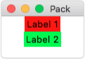
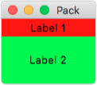
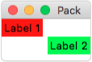
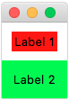
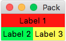
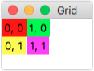
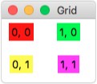
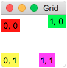
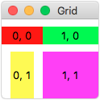
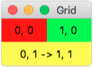

Geometrie-Manager (Anordnung)
-----------------------------

Mit Hilfe des Geometrie-Managers können wir die Anordnung der Widgets im Fenster bestimmen. Die beiden wichtigsten sind `Pack`_ und `Grid`_.

Pack
""""

Beim Pack-Geometrie-Manager "packen" wir die Widgets nacheinander in das Fenster. In unserem Beispiel verwenden wir Labels, aber das Prinzip gilt für alle Widgets. Wenn wir keine Optionen angeben, werden die Widgets untereinander gepackt und sind nur so groß wie nötig:

.. code-block:: python
    :linenos:

    label_1 = Label(master=fenster, text="Label 1", background="red")
    label_1.pack()

    label_2 = Label(master=fenster, text="Label 2", background="green")
    label_2.pack()

Über die Optionen ``fill`` und ``expand`` können wir steuern, ob die Widgets mehr Platz bekommen als nötig. Der Parameter ``fill`` kann die Werte ``X``, ``Y`` oder ``BOTH`` annehmen. 

.. code-block:: python
    :linenos:

    label_1 = Label(master=fenster, text="Label 1", background="red")
    label_1.pack(fill=X)

    label_2 = Label(master=fenster, text="Label 2", background="green")
    label_2.pack(fill=BOTH, expand=True)

Über den Paramter ``anchor`` legen wir fest, an welcher Seite die Widgets ausgerichtet werden. Folgende Werte sind möglich: ``NW``, ``N``, ``NE``, ``E``, ``SE``, ``S``, ``SW``, ``W`` und ``CENTER``. Die Buchstaben kommen von den englischen Namen für die Himmelsrichtungen: (N)orth, (E)ast, (S)outh und (W)est.

.. code-block:: python
    :linenos:

    label_1 = Label(master=fenster, text="Label 1", background="red")
    label_1.pack(anchor=W)

    label_2 = Label(master=fenster, text="Label 2", background="green")
    label_2.pack(anchor=E)

Wenn wir den Widgets etwas mehr Abstand zueinander geben wollen, können wir die Paramter ``padx`` und ``pady`` verwenden. Für den Abstand innerhalb des Widgets heißen sie ``ipadx`` und ``ipady``.

.. code-block:: python
    :linenos:

    label_1 = Label(master=fenster, text="Label 1", background="red")
    label_1.pack(padx=10, pady=10)

    label_2 = Label(master=fenster, text="Label 2", background="green")
    label_2.pack(ipadx=10, ipady=10)

Über den ``side`` Paramter können wir die Widgets auch nebeneinander anordnen. Die möglichen Werte sind ``LEFT``, ``TOP``, ``RIGHT`` und ``BOTTOM``.

.. code-block:: python
    :linenos:

    label_1 = Label(master=fenster, text="Label 1", background="red")
    label_1.pack(fill=X)

    label_2 = Label(master=fenster, text="Label 2", background="green")
    label_2.pack(side=LEFT)

    label_3 = Label(master=fenster, text="Label 3", background="yellow")
    label_3.pack(side=RIGHT)

Grid
""""

Beim Grid-Geometrie-Manager unterteilen wir das Fenster in Gedanken in Zeilen (row) und Spalten (column). Für jedes Widget können wir nun angeben, an welcher Postion auf dem Gitter es angezeigt werden soll.

.. code-block:: python
    :linenos:

    label_1 = Label(master=fenster, text="0, 0", background="red")
    label_1.grid(column=0, row=0)

    label_2 = Label(master=fenster, text="1, 0", background="green")
    label_2.grid(column=1, row=0)

    label_3 = Label(master=fenster, text="0, 1", background="yellow")
    label_3.grid(column=0, row=1)

    label_4 = Label(master=fenster, text="1, 1", background="magenta")
    label_4.grid(column=1, row=1)

Damit sich das Gitter mit dem Fenster vergößert, können wir den Spalten und Zeilen ein relatives Gewicht (``weight``) zuweisen.

.. code-block:: python
    :linenos:

    fenster.columnconfigure(0, weight=1)
    fenster.columnconfigure(1, weight=2)

    fenster.rowconfigure(0, weight=1)
    fenster.rowconfigure(1, weight=2)

Wenn die Gitterzelle größer ist als das Widget, können wir das Verhalten über den ``sticky`` Parameter steuern. Als Werte sind wieder die Himmelsrichtungen ``N``, ``E``, ``S``, ``W`` und Kombinationen daraus möglich.

.. code-block:: python
    :linenos:

    label_1 = Label(master=fenster, text="0, 0", background="red")
    label_1.grid(column=0, row=0, sticky=W)

    label_2 = Label(master=fenster, text="1, 0", background="green")
    label_2.grid(column=1, row=0, sticky=NE)

    label_3 = Label(master=fenster, text="0, 1", background="yellow")
    label_3.grid(column=0, row=1, sticky=SW)

    label_4 = Label(master=fenster, text="1, 1", background="magenta")
    label_4.grid(column=1, row=1, sticky=S)

Wenn wir gegenüberliegende Himmelsrichtungen, z.B. ``N`` und ``S`` kombinieren, wird die Zelle gestreckt.

.. code-block:: python
    :linenos:

    label_1 = Label(master=fenster, text="0, 0", background="red")
    label_1.grid(column=0, row=0, sticky=EW)

    label_2 = Label(master=fenster, text="1, 0", background="green")
    label_2.grid(column=1, row=0, sticky=EW)

    label_3 = Label(master=fenster, text="0, 1", background="yellow")
    label_3.grid(column=0, row=1, sticky=NS)

    label_4 = Label(master=fenster, text="1, 1", background="magenta")
    label_4.grid(column=1, row=1, sticky=NSEW)

Über die Parameter ``columnspan`` bzw. ``rowspan`` können wir erreichen, das mehrere Zellen zusammengefasst werden.

.. code-block:: python
    :linenos:

    label_1 = Label(master=fenster, text="0, 0", background="red")
    label_1.grid(column=0, row=0, sticky=NSEW)

    label_2 = Label(master=fenster, text="1, 0", background="green")
    label_2.grid(column=1, row=0, sticky=NSEW)

    label_3 = Label(master=fenster, text="0,1 -> 1,1", background="yellow")
    label_3.grid(column=0, row=1, sticky=NSEW, columnspan=2)
