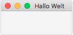
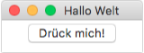
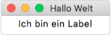
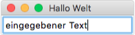

Oberflächen mit TK (tkinter)
============================

Das Modul ``tkinter`` können wir benutzen, um grafische Bedienoberflächen zu programmieren.

Fenster
-------

Als erstes erzeugen wir ein Fenster, in dem wir die Elemente unseres Programs anordnen können.

.. code-block:: python
    :linenos:

    from tkinter import *           # das modul tkinter wird importiert

    fenster = Tk()                  # ein Fenster wird erzeugt
    fenster.title("Hallo Welt")     # wir setzen den Titel des Fensters

    fenster.mainloop()              # wir starten die Anwendung

So ungefähr sieht das Ergebnis aus: 

|br|

Widgets
-------

Die einzelnen Elemente der Oberfläche werden Widgets genannt.

Button
^^^^^^

Ein Button (auch Schaltfläche) wird benutzt, wenn eine einzelne Aktion ausgeführt werden soll.
Als erstes definieren wir eine Funktion, die beim Click auf den Button aufgerufen wird:

.. code-block:: python
    :linenos:

    def button_clicked():
        print("Der Button wurde gedrückt")

nun können wir den Button erzeugen und anzeigen:

.. code-block:: python
    :linenos:

    button = Button(master=fenster, text="Drück mich!", command=button_clicked)
    button.pack()

In Zeile 1 wird er Button erstellt. Mit dem Parameter ``text`` können wir festlegen, was auf dem Button steht. Über den Paramter ``command`` verknüpfen wird den Button mit unserer Funktion von oben.
In Zeile 2 wird unser Button zur Oberfläche hinzugefügt und angezeigt. 

Wenn wir das Program starten, könnte das z.B. so aussehen.
Bei einem Click auf den Button sollten wir in der Console den Text 'Der Button wurde gedrückt' sehen.

|br|

Label
^^^^^

Labels sind Widgets mit denen man Text anzeigen kann. Wichtig ist hier Zeile 2, da wird der Text gesetzt.

.. code-block:: python
    :linenos:

    label = Label(master=fenster)
    label.config(text="Ich bin ein Label")
    label.pack()

|br|

Entry
^^^^^

Ein Entry-Widget ist ein Eingabefeld, in das man Text eintragen kann. Wir könnten es z.B. benutzen, um den Nutzer nach seinem Namen zu fragen.

.. code-block:: python
    :linenos:

    eingabe_feld = Entry(master=fenster)
    eingabe_feld.pack()

Um den Text aus dem Widget auszulesen, benutzen wir die get() Methode:

.. code-block:: python
    :linenos:

    eingabe = eingabe_feld.get()
    print(eingabe)
